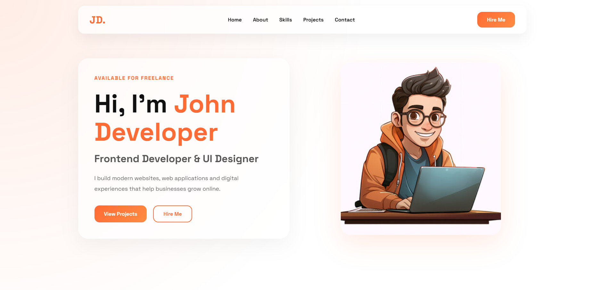

# 🚀 Developer Portfolio Template

A modern, responsive, and professional developer portfolio template built using HTML, CSS, JavaScript, and PHP.

Designed for developers, freelancers, designers, students, and creators who want to showcase their skills, projects, and services with a clean and modern user interface.

---

## ✨ Features

- 🎨 Modern Glassmorphism Design
- 📱 Fully Responsive Layout
- ⚡ Smooth Scrolling Navigation
- 📊 Animated Statistics Counter
- 💼 Projects Showcase Section
- ⭐ Testimonials Section
- 📞 Contact Section
- 🚀 Call-To-Action Area
- 🌙 Clean & Professional UI
- 🔥 SEO Friendly Structure
- 📧 PHP Contact Form Ready
- 🎯 Easy Customization

---

## 📸 Preview



---

## 🛠 Technologies Used

- HTML5
- CSS3
- JavaScript
- PHP
- Font Awesome
- Google Fonts

---

## 📂 Project Structure

```bash
developer-portfolio/
│
├── index.php
├── contact.php
│
├── includes/
│   ├── header.php
│   └── footer.php
│
├── assets/
│   ├── css/
│   │   └── style.css
│   │
│   ├── js/
│   │   └── main.js
│   │
│   └── images/
│       ├── profile.jpg
│       ├── hero-image.png
│       └── preview.jpg
│
└── README.md
```

---

## 📋 Sections Included

### Hero Section
- Professional introduction
- Call-To-Action buttons

### About Section
- Personal introduction
- Experience cards

### Services Section
- Service showcase cards

### Projects Section
- Portfolio projects
- Live Demo & Source buttons

### Statistics Section
- Animated counters

### Testimonials Section
- Client reviews

### CTA Section
- Lead generation area

### Contact Section
- Contact information
- Contact form

### Footer
- Social media links
- Quick navigation links

---

## 🚀 Getting Started

### Clone Repository

```bash
git clone https://github.com/yourusername/developer-portfolio.git
```

### Open Project

Place the project inside your local server directory.

Example:

```bash
xampp/htdocs/developer-portfolio
```

### Run Project

Start Apache from XAMPP and visit:

```text
http://localhost/developer-portfolio
```

---

## 🎨 Customization

Replace:

```text
John Developer
```

with your name.

Update:

```text
Profile Image
Projects
Services
Social Media Links
Contact Information
```

to match your personal brand.

---

## 📱 Responsive Design

The template is optimized for:

- Desktop
- Laptop
- Tablet
- Mobile Devices

---

## 🔗 Social Links

Update the social links inside the footer:

```html
Github
LinkedIn
Instagram
Facebook
Email
```

---

## 📈 Future Improvements

- Dark Mode Toggle
- Blog Section
- Project Filtering
- Admin Dashboard
- CMS Integration
- Multi-language Support

---

## 🤝 Contributing

Contributions, issues, and feature requests are welcome.

Feel free to fork the project and submit a pull request.

---

## 📜 License

This project is licensed under the MIT License.

You are free to use, modify, and distribute this template for personal and commercial projects.

---

## 👨‍💻 Author

**Yash Patne**


Built with ❤️ for developers, freelancers, and creators worldwide.

---

⭐ If you like this project, consider giving it a star on GitHub.
